# OCI CRM AI — ERD (Entity Relationship Diagram)

| 항목 | 내용 |
|------|------|
| DB명 | oci_crm |
| 작성일 | 2026-05-09 |
| 표기법 | Crow's Foot Notation (Mermaid erDiagram) |

---

## ERD 다이어그램 (Mermaid)

> 아래 코드를 [Mermaid Live Editor](https://mermaid.live) 또는 VSCode Mermaid 플러그인에서 렌더링하세요.

```mermaid
erDiagram

    %% ── 핵심 비즈니스 엔터티 ──────────────────────────────

    customers {
        int     id              PK
        varchar name            "고객사명"
        enum    region          "국내/해외"
        varchar country
        varchar industry
        varchar contact_person
        varchar phone
        varchar email
        timestamp created_at
        timestamp updated_at
    }

    team_members {
        int     id              PK
        varchar name
        enum    role            "CS/Field/Sales"
        varchar team            "소속팀"
        varchar email
        int     monthly_token_limit
        tinyint is_active
        timestamp created_at
    }

    leads {
        int      id             PK
        int      customer_id    FK
        varchar  customer_name
        varchar  project_name
        enum     business_type  "태양광/모듈/EPC/ESS/전기/설치"
        enum     region         "국내/해외"
        decimal  capacity_mw
        decimal  expected_amount "억원"
        enum     stage          "lead→won/lost/dropped"
        int      assigned_to    FK
        date     expected_close_date
        date     bidding_deadline
        timestamp created_at
        timestamp updated_at
    }

    projects {
        int     id              PK
        varchar name
        int     customer_id     FK
        int     lead_id         FK
        int     assigned_to     FK
        decimal contract_amount "계약금액(억원)"
        decimal estimated_cost  "원가(억원)"
        decimal margin_pct      "마진율(%)"
        enum    status          "진행중/완료 등"
        date    due_date
        timestamp created_at
        timestamp updated_at
    }

    activities {
        int     id              PK
        int     lead_id         FK
        int     project_id      FK
        int     performed_by    FK
        varchar activity_type
        varchar title
        text    content
        int     calendar_event_id "논리참조"
        timestamp performed_at
    }

    %% ── 일정 / 회의록 ────────────────────────────────────

    calendar_events {
        int     id              PK
        varchar title
        datetime start_datetime
        datetime end_datetime
        tinyint all_day
        varchar event_type      "미팅/입찰 등"
        int     lead_id         "논리참조"
        int     assigned_to     "논리참조"
        varchar customer_name
        varchar status          "planned/completed"
        timestamp created_at
    }

    meeting_minutes {
        int       id             PK
        varchar   title
        date      meeting_date
        int       lead_id        "논리참조"
        int       calendar_event_id "논리참조"
        varchar   customer_name
        mediumtext raw_transcript
        mediumtext speakers_json
        mediumtext summary_md
        text      action_items
        int       created_by     "논리참조"
        timestamp created_at
    }

    %% ── 원가 관리 ────────────────────────────────────────

    products {
        int     id              PK
        varchar name
        varchar category        "원자재/모듈/부품/인건비"
        decimal current_price
        decimal previous_price
        decimal change_pct      "변동률%"
        varchar currency
        date    last_updated
        timestamp updated_at
    }

    cost_history {
        int     id              PK
        int     product_id      FK
        decimal price
        date    recorded_at
        varchar notes
    }

    %% ── 게시판 / 설정 ────────────────────────────────────

    announcements {
        int     id              PK
        varchar title
        text    content
        tinyint is_pinned
        int     created_by      "논리참조"
        timestamp created_at
        timestamp updated_at
    }

    comments {
        int     id              PK
        varchar ref_type        "polymorphic"
        int     ref_id          "대상ID"
        text    content
        varchar author_name
        timestamp created_at
    }

    faq {
        int  id                 PK
        text question
        text answer
        varchar category
        timestamp created_at
    }

    %% ── 시스템 / 로그 ────────────────────────────────────

    users {
        int     id              PK
        varchar username        UK
        varchar email           UK
        varchar password_hash
        enum    role            "manager/team_lead/executive/superadmin"
        tinyint otp_enabled
        varchar webauthn_cred_id
        datetime last_login
        timestamp created_at
    }

    ai_usage {
        int     id              PK
        int     user_id         "논리참조"
        varchar endpoint
        int     prompt_tokens
        int     completion_tokens
        int     total_tokens
        varchar model
        timestamp created_at
    }

    access_logs {
        int     id              PK
        varchar method
        varchar path
        int     status_code
        int     duration_ms
        varchar ip
        timestamp created_at
    }

    system_settings {
        varchar setting_key     PK
        varchar setting_value
        timestamp updated_at
    }

    %% ── 관계 정의 (선언된 FK) ─────────────────────────────

    customers     ||--o{ leads        : "1:N 영업기회 보유"
    customers     ||--o{ projects     : "1:N 프로젝트 보유"
    team_members  ||--o{ leads        : "1:N 담당 리드"
    team_members  ||--o{ projects     : "1:N 담당 프로젝트"
    team_members  ||--o{ activities   : "1:N 활동 수행"
    leads         ||--o{ activities   : "1:N 활동 기록"
    leads         ||--o| projects     : "1:1 수주→프로젝트"
    projects      ||--o{ activities   : "1:N 활동 기록"
    products      ||--o{ cost_history : "1:N 가격 이력"
```



---

## 관계 상세 설명

### 핵심 비즈니스 관계

```
customers (1) ──── (N) leads
  └─ 한 고객사는 여러 영업기회(리드)를 보유할 수 있음
  └─ leads.customer_id → customers.id (FK, SET NULL on delete)

customers (1) ──── (N) projects
  └─ 한 고객사는 여러 프로젝트를 가질 수 있음
  └─ projects.customer_id → customers.id (FK, SET NULL on delete)

leads (1) ──── (0~1) projects
  └─ 리드가 수주(won)되면 프로젝트로 전환 (1:1 또는 비연결)
  └─ projects.lead_id → leads.id (FK, SET NULL on delete)

team_members (1) ──── (N) leads
  └─ 한 팀원이 여러 리드를 담당
  └─ leads.assigned_to → team_members.id (FK, SET NULL on delete)

team_members (1) ──── (N) projects
  └─ 한 팀원이 여러 프로젝트를 담당
  └─ projects.assigned_to → team_members.id (FK, SET NULL on delete)

leads (1) ──── (N) activities
  └─ 한 리드에 여러 영업 활동이 기록됨
  └─ activities.lead_id → leads.id (FK, CASCADE on delete)

projects (1) ──── (N) activities
  └─ 한 프로젝트에 여러 활동이 기록됨
  └─ activities.project_id → projects.id (FK, CASCADE on delete)

team_members (1) ──── (N) activities
  └─ 한 팀원이 여러 활동을 수행
  └─ activities.performed_by → team_members.id (FK, SET NULL on delete)

products (1) ──── (N) cost_history
  └─ 한 상품은 가격 이력을 다수 보유
  └─ cost_history.product_id → products.id (FK, CASCADE on delete)
```

### 논리적 참조 관계 (FK 미선언)

```
leads (1) ──── (N) calendar_events
  └─ calendar_events.lead_id → leads.id (논리 참조)

leads (1) ──── (N) meeting_minutes
  └─ meeting_minutes.lead_id → leads.id (논리 참조)

calendar_events (1) ──── (N) activities
  └─ activities.calendar_event_id → calendar_events.id (논리 참조)

calendar_events (1) ──── (0~1) meeting_minutes
  └─ meeting_minutes.calendar_event_id → calendar_events.id (논리 참조)

team_members (1) ──── (N) meeting_minutes
  └─ meeting_minutes.created_by → team_members.id (논리 참조)

users (1) ──── (N) ai_usage
  └─ ai_usage.user_id → users.id (논리 참조)

users (1) ──── (N) announcements
  └─ announcements.created_by → users.id (논리 참조)

comments (polymorphic)
  └─ ref_type + ref_id 조합으로 announcements, leads 등 여러 엔터티 참조
```

---

## 엔터티 그룹 분류

```
┌─────────────────────────────────────────────────────────────┐
│  핵심 영업 도메인                                            │
│  customers → leads → projects → activities                  │
│             ↕              ↕                                │
│         team_members   team_members                         │
├─────────────────────────────────────────────────────────────┤
│  일정 / 커뮤니케이션                                         │
│  calendar_events ←→ leads                                   │
│  meeting_minutes ←→ leads / calendar_events                 │
├─────────────────────────────────────────────────────────────┤
│  원가 관리                                                   │
│  products → cost_history                                    │
├─────────────────────────────────────────────────────────────┤
│  커뮤니티 / 게시판                                           │
│  announcements / comments (polymorphic) / faq               │
├─────────────────────────────────────────────────────────────┤
│  시스템 / 운영                                               │
│  users / ai_usage / access_logs / system_settings           │
└─────────────────────────────────────────────────────────────┘
```

---

## 삭제 정책 요약

| 정책 | 적용 관계 | 설명 |
|------|----------|------|
| **CASCADE** | activities ← leads, projects / cost_history ← products | 부모 삭제 시 자식도 함께 삭제 |
| **SET NULL** | leads ← customers, team_members / projects ← customers, leads, team_members | 부모 삭제 시 FK를 NULL로 처리 (데이터 보존) |
| 논리적 참조 | 나머지 모든 참조 | FK 미선언, 애플리케이션 레벨에서 정합성 관리 |

---

# 🆕 v5.0 추가 테이블

## 1. report_definitions — 사용자 정의 리포트

```
┌─────────────────────────┐
│ report_definitions      │
├─────────────────────────┤
│ id (PK)                 │
│ user_id ──────► users   │
│ name                    │
│ description             │
│ config_json (JSON)      │
│ is_shared (Phase 2)     │
│ created_at, updated_at  │
└─────────────────────────┘
```

**config_json** 형식:
```json
{
  "datasource": "leads",
  "rows": ["stage"],
  "columns": ["region"],
  "filters": [{"field":"region","op":"eq","value":"국내"}],
  "measures": ["count", "sum_expected_amount"],
  "chartType": "auto"
}
```

## 2. dev_features_audit — 토글 변경 이력

```
┌─────────────────────────┐
│ dev_features_audit      │
├─────────────────────────┤
│ id (PK)                 │
│ feature_key ──► dev_features  │
│ old_enabled (0/1)       │
│ new_enabled (0/1)       │
│ changed_by ──► users    │
│ changed_at              │
│ reason                  │
└─────────────────────────┘
INDEX (feature_key, changed_at)
```

## 3. dev_features 컬럼 확장

기존 `dev_features` 테이블에 추가된 컬럼:

| 컬럼 | 타입 | 설명 |
|------|------|------|
| `risk_level` | ENUM('safe','medium','high','critical') | 위험도 |
| `required_features` | VARCHAR(500) | JSON 배열 — 의존성 |
| `is_deprecated` | TINYINT(1) | 매니페스트 제거 표시 |
| `last_changed_by` | INT | 마지막 변경자 |
| `last_changed_at` | TIMESTAMP | 마지막 변경 시각 |

## 4. system_settings 신규 키

`logo_path` — 커스텀 로고 URL 저장 (NULL 시 기본 SVG 사용)

---

# 📐 v5.0 전체 테이블 수: **27개** (기존 24 + 신규 2 + 컬럼 확장 1)
